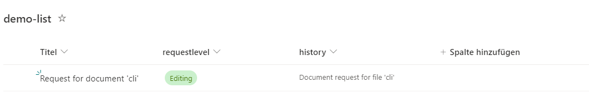
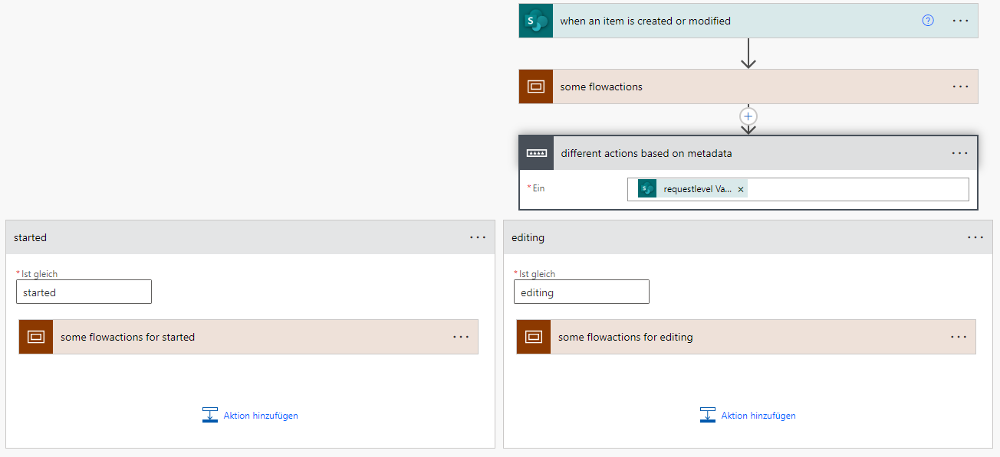

# Automate your Flowtest with CLI for Microsoft 365

This script was created for flows with SharePoint Online triggers.

## Use-Case

The flow under test in this example represents an approval process. In this case the flow triggers when an item is created or modified in the sharepoint list **'demolist'**. 



Depending on the stored metadata of the list column "requestlevel" the flow runs through different actions. This distinction is implemented by a switch statement. The flow is build like this: 




When the flow finished the enduser get a notification to take action. At this point the user has to edit the sharepoint metadata which we do with a button on the sharepoint form. So in this case we know which metadata are modified by the user. 

## Preperation: Adjusting the script to your use case

### Create Testdata 

["m365 spo listitem add"](https://pnp.github.io/cli-microsoft365/cmd/spo/listitem/listitem-add)

```powershell
function createTestData{
    <#
    * ADD YOUR TESTMETADATA
    * Customize this part to your system / testdata
    * trigger elements of flow runs that are not included to your testdata are not monitored
    * alternativ: just return the itemId's of manual created testdata
    #>
    $i = 0
    $testMetadata = @()

    do{
        $testMetadata += m365 spo listitem add --contentType 'Item' --listTitle $spListTitle --webUrl $spSiteUrl --Title "Test-Item $i" --RequestLevel "Started"
        $i++
    }until($i -eq 10)   

    return $testMetadata.id
}
```


### Simulate User Input 

```powershell
# ----------------------------- in my case i need to get the current request level 
# based on spColoumn : requestlevel
$currentRequestLevel = $flowRunInformation.triggerInformation.requestlevel.Value


# Here you need to put your different update actions which simulated your user input to the sharepoint item
switch($currentRequestLevel){
    'Started'{
        m365 spo listitem set --listTitle $spListTitle --id $itemId --webUrl $spSiteUrl --Genehmigungslevel 'Editing'
    }
    'Editing'{
        m365 spo listitem set --listTitle $spListTitle --id $itemId --webUrl $spSiteUrl --Genehmigungslevel 'Approval'
    }
    'Approval'{
        m365 spo listitem set --listTitle $spListTitle --id $itemId --webUrl $spSiteUrl --Genehmigungslevel 'Release'
    }
    'Release'{
        # this is the last step -> so there is nothing to do
    }
}
```

## Start the Script

Start the script in your editor (VS Studio or PowerShell ISE) or run it from your commandline
```powershell
 .\automate_flowtest.ps1 -environment '<Your Environment ID>' -flow '<FlowID or DisplayName>' -spSiteUrl '<URL of our SharePoint Site' -spListTitle '<DisplayName of your list>'
```

## Review your test 

The monitoring of the flow runs are stored in an endless loop. If you finished your test wait a few minutes (get yourself a new coffee) and just end the script run. Execute the following code to "review" your test:

```powershell
# run this for feedback, when you are finished 

Write-Output ("Total flowruns : {0}`n "-f $flowRunsCount)
Write-Output ("succeded flowruns : {0} `n"-f $successFlowRunsCount)
Write-Output ("canceled flowruns : {0} `n"-f $CancelledFlowRunsCount)
Write-Output ("failed flowruns : {0} `n"-f $failedFlowRunssCount)

```
## Using: CLI for Microsoft 365 

Since the [Version 6.7 CLI for Microsoft 365](https://pnp.github.io/cli-microsoft365/about/release-notes#v670) the command ["m365 flow run get"](https://pnp.github.io/cli-microsoft365/cmd/flow/run/run-get) return all the triggerInformation while using the parameter "-includetriggerInformation". With this command you can directly relate between flowrun and trigger item like a modified sharepoint list item. 


### [Install CLI for Microsoft 365](https://pnp.github.io/cli-microsoft365/)
```powershell
npm i -g @pnp/cli-microsoft365
```

[More about CLI for Microsoft 365](../../docfx/includes/MORE-CLIM365.md)


##

| Author |
| ----------- |
| [Joshua Probst](https://github.com/joshua-probst) |
